## Bienvenue dans la doc de "mon-lit" une réalisation d'un cadre de lit **190x140** en bois.

Le lit mesure près de 2,50 m de large et 2 m de long puisqu'il inclut une tête de lit avec des consoles latérales. Il pourra recevoir un sommier à lattes fin (pas de tapissier) d'environ 5 cm d'épaisseur et d'un matelas par dessus qui sera calé aussi par 5 cm de bois.

Afin de faciliter sa construction je me limite en approvisionnement en matériaux : planches et tasseaux de pin, ferrures d'assemblage, vis, colle vinylique.

Suivant votre budget, certaines planches peuvent être approvisionnées en chêne (tête et cadre) plutôt qu'en pin.

- Planches pin raboté 200 x 28 (plus de 2,5 m de long) ;
- Planches pin raboté 100 x 28 (plus de 1,5 m de long) ;
- Tasseaux pin raboté 50 x 30 approx. (plus de 2 m de long) ;
- Ferrures d'angle de lit, équerres de fixation, visserie, tourillons, colle blanche.

J'ai commencé par le modéliser avec l'outil [OpenSCAD](https://www.openscad.org/) afin d'estimer les éléments qu'il me faudra approvisionner pour le construire.

### Pieds

Le lit est posé sur 2 pieds placés sous le lit (!) mais qui demeurent invisibles.

Les pieds sont formés d'une barre transversale au lit sur laquelle repose le reste du cadre porteur.

L'ensemble forme un T en section, composée de 2 planches de 1m de long et fixées entre-elles, sur lesquelles vient une troisième planche horizontale pourvue d'une rainure recevant les 2 précédentes. Enfin, les tronçons d'une 4ème planche viennent renforcer et fixer les éléments de soutient du sommier.

On va partir sur :

- [4 Planches douglas petits nœuds raboté, 100 x 28 mm, long 250 cm (🛒 Leroy-Merlin)](https://www.leroymerlin.fr/v3/p/produits/planche-douglas-petits-noeuds-rabote-100x28-mm-long-250cm-e133258) ; Vérifiez bien l'égalité de largeur des planches…

#### Découper

1. Prélever sur chacune des 4 planches une longueur de 100 cm ;
2. Il reste donc 4 planches de 150 cm ;
3. Partager 2 (des 4) planches de 150 cm en deux (75 cm) ;
4. Vous aurez donc :
   - 2 planches de 150 cm ;
   - 4 planches de 100 cm ;
   - 4 planches de 75 cm.

#### Assembler la partie centrale du pied

1. Coller et assembler 2 planches de 100 cm. Serre-jointer et ajouter des vis 5 x 40 de part et d'autre pour maintenir les planches serrées ;
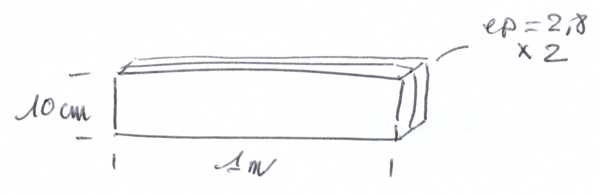
2. Découper les biseaux à 45° aux extrémités en laissant 1 cm de bois vertical ;
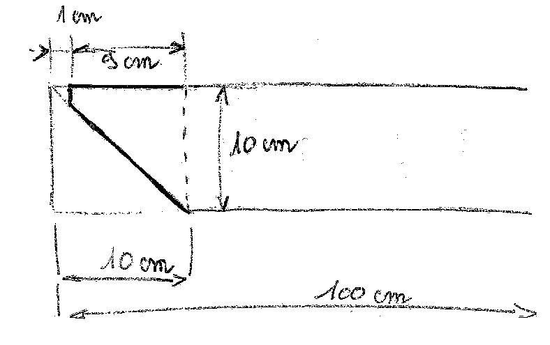
3. Arrondir les bords (sauf dessus) à la défonceuse (fraise 1/4 de rond).
4. Répéter une seconde fois pour former 2 pieds.

On obtient ainsi 2 barres biseautées, comme ci-dessous :

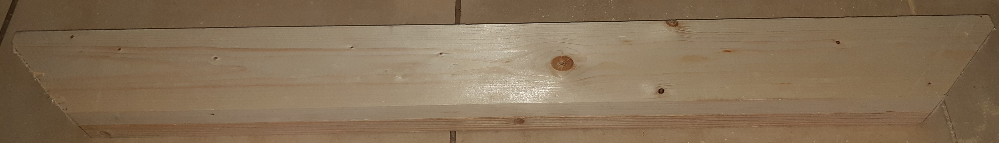

#### Mettre la barre au T

1. Une planche de 142/150 cm recevra une rainure centrale de `28 * 2 = 56 mm` de large sur 1 m de long centrée sur la planche et d'une profondeur de 1 à 2 mm (_la profondeur doit être la même sur les 2 pieds et sur toute leur longueur_).

2. La planche reçoit dans sa rainure la barre biseautée précédente après encollage. Vérifier l'équerrage et serre-jointer avant de  visser par le dessus de la planche.
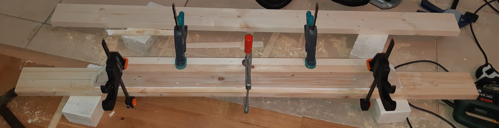
3. _Les tronçons de planche supplémentaires ne seront ajoutés qu'après constitution du reste du cadre._

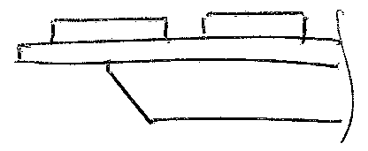

### Tête de lit

La tête de lit est réalisée par un empilement de planches (rabotées) ; elle pourra être complétée par une baguette d'angle, voir par des tasseaux équipés d'une rainure pour recevoir ces planches sur les 3 côtés.

On utilisera :

- [5 Planches douglas petits nœuds raboté, 200 x 28 mm, long 250 cm (🛒 Leroy-Merlin)](https://www.leroymerlin.fr/v3/p/produits/planche-douglas-petits-noeuds-rabote-200x28-mm-long-250cm-e133257) ;
- 100 Tourillons ⌀10 x 40 mm ;
- Colle à bois vinylique type D3 ou mieux colle PU (⚠ Ça tache !).

#### Empilement

L'empilement sera assuré par le positionnement de tourillons ⌀10 x 40 mm. Le percement se fera avec un guide de perçage afin de garantir l'alignement parfait des trous sur les 2 planches successives.

> Choisir des planches et orienter les cernes cœur contre cœur et bord contre bord, les cernes toujours dans le même sens :
<figure markdown=1>

  <figcaption markdown=1>
_D'après L'air du bois - https://www.lairdubois.fr/trouvailles/925-comment-bien-assembler-des-lames-de-bois-massif-en-panneau.html_
  </figcaption>
</figure>

1. **Tracer :**
 
Aligner les 2 planches et tracer simultanément sur les 2 planches tous les 20 cm à partir de 10 cm du bord, prolonger les repères sur la tranche à l'aide d'une équerre.
 
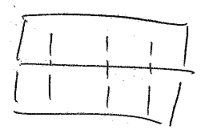

2. **Percer :**
 
À l'aide d'un guide, percer au milieu de chaque tranche de planche en respect des traçages précédents. Respecter une profondeur de perçage à la moitié de la longueur des tourillons.
 
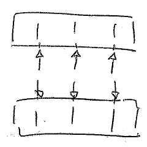

3. **Coller :**
 
Encoller les tranches et les trous de perçage avant de placer les tourillons. Étaler la colle afin qu'elle couvre parfaitement les 2 tranches.
 
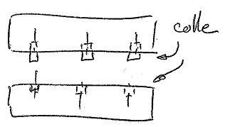

4. **Serrer :**
 
Mettre l'ensemble sous presse pendant 24h, en s'assurant de la planéité de l'assemblage.
 
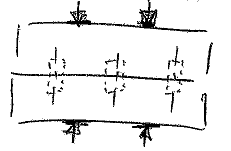

### Cadre et support du sommier
Le cadre est composé par 3 planches de 20 mm de hauteur attachées par des charnières métalliques. Des tasseaux rabotés 30 x 50 mm (env.) viendront permettre les appuis nécessaires à la fois pour les pieds fabriqués précédemment, comme pour le sommier 140 x 190 métallique à lattes cm.

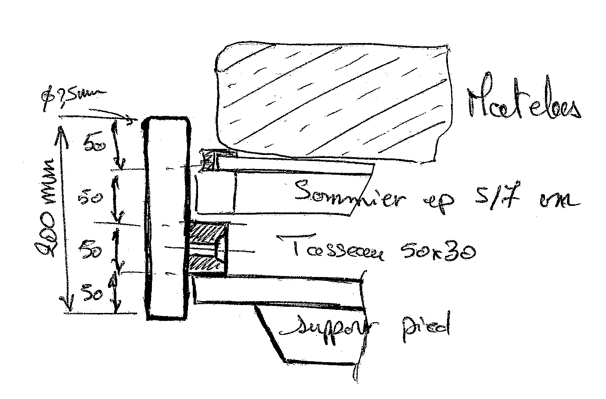

- [3 Planches douglas petits nœuds raboté, 200 x 28 mm, long 250 cm (🛒 Leroy-Merlin)](https://www.leroymerlin.fr/v3/p/produits/planche-douglas-petits-noeuds-rabote-200x28-mm-long-250cm-e133257) ;
- [Lot de 6 tasseaux sapin petits noeuds brut, 32 x 50 mm, L.2.4 m (🛒 Leroy-Merlin)](https://www.leroymerlin.fr/v3/p/produits/lot-de-6-tasseaux-sapin-petits-noeuds-brut-32-x-50-mm-l-2-4-m-e62068) ;
- 4 ferrures de lit bloquantes (à vis) :  ou 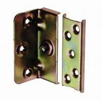
- 2 ferrures de soutien de la barre centrale : 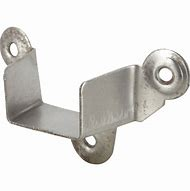

#### Planches latérales

1. Couper 2 planches de 20 cm de hauteur à la longueur du sommier, ici 190 cm (mesurer ou _mieux : présenter le sommier + 2 cm_).

2. Couper la longueur des 2 tasseaux à 170 cm pour réserver l'emplacement des ferrures ;

3. Tracer sur le bord de 50 mm du tasseau tous les 17 cm les pré-perçages des vis pour la fixation tasseau/planche :
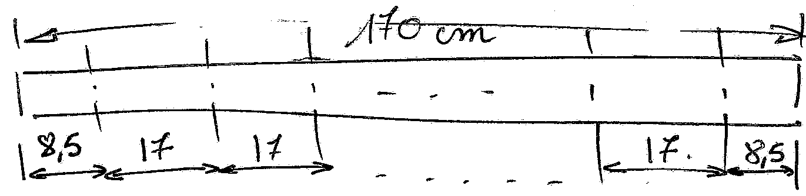
Percer au centre des traits les passages de vis à ⌀3 mm et biseauter avec une fraise pour tête de vis.

4. Tracer sur la planche de 20 mm l'emplacement du tasseau à 35 mm du bas de la planche et à 10 cm de chaque extrémités.

5. Tracer aussi sur les bords de 30 mm des tasseaux aux tiers de leur longueur, les positions de vis permettant de les fixer sur les pieds, prévoir 2 vis par extrémité à 5 cm de part et d'autre de l'axe du tiers :
 
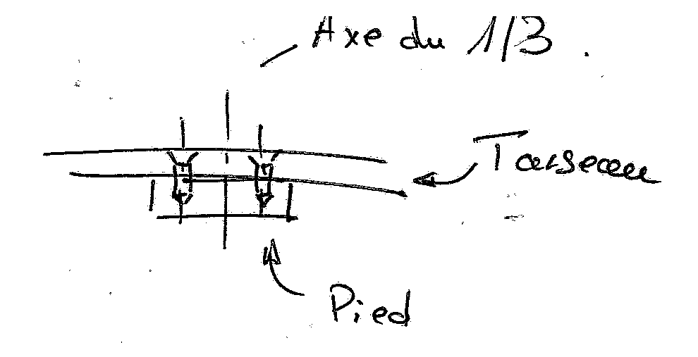
Percer et biseauter les passages des vis vers les pieds.

6. Encoller les 2 tasseaux sur toute leur longueur, les positionner sur chaque planche et les fixer avec des serre-joints entre chaque trou de vis. Visser avec des vis ⌀ 5x40 mm. Laisser sécher le temps nécessaire (4h).

6. Positionner les pieds sous les tasseaux au niveau des pré-perçage (Pt. 5), fixer en position (alignement, angles droits) avec un serre-joint avant de fixer avec des vis ⌀ 5x60 mm.

7. Fixer les ferrures à mi-hauteur des planches entre les côtés et la planche de pied, et entre les côtés et la tête de lit.

8. Former les arrondis sur les 2 angles du haut de chaque planche à la défonceuse ou à l'affleureuse.

